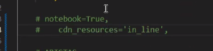

# TP05

### Ejercicio 2

Al crawler se le pasan las semillas, que es el punto donde empieza a descargar

- Es importante darle una buena lista de sitios para empezar
    - Para que no muera el crawl en pocos nodos

Parámetros

- conjunto semilla → podemos hardcodear los 20 primeros sitios de Netcraft (no hace falta complicarse)
- Ya agregar una restriccion de dominio, porque se usará en el ejercicio 3

Profundidad

- Profundidad lógica → profundidad de clicks
    - Podemos encontrar un enlace que tenga 10 “/”, pero accedimos a él con 1 click → entonces la profundidad física es de 10
- Profundidad física → la cantidad de “/” en la URL

### Problema con nodos moviendose en el grafico (nunca convergen y se chocan constantemente)

cdn_resource



### Ejercicio 3

- Qué hacemos con las páginas dinámicas? Tomaremos un criterio
    - “Para este experimento/caso, se consideró como página dinámica a… y como páginas estáticas aquellas que…”
    - Justificar nuestra decisión

### Ejercicio 4

- Usar planilla de cálculo, para que puedan corregirnos el cálculo de PageRank
    - NO HAY UNA PLANTILLA COMO LOS TPs ANTERIORES
- tENGO UN VECTOR, ordenado por cómo recorrió el crawler
    - Puedo reordenarlo por el PageRank, o por el valor de Authority
    - Entonces, tendríamos 3 listas, la original, y luegos otras 2 ordenadas según distintos valores
- Luego puedo comparar el primer 10% de la lista ordenada por PageRank vs el 10% de la lista ordenada por Authority (HITS)
    - Comparar los elementos en cada lista, si son similares o si correlacionan

### Librerías

- requests
- from urllib.parse import urlparse → para parsear las URLs
- import queue from Queue
- import networkx as nx → para los grafos?
- from bs4 import BeautifulSoup
- from functools import lru_cache → crea caché, para evitar muchas consultas a una URL

### Crawler

- Agregar header User-Agent: ‘Mozilla/5.0’ por ejemplo, para que el servidor crea que somos un navegador y evitar problemas
- Limitar request por segundo si es necesario
- Usar solo los href de los <a> para obtener los links salientes
- soup.find_all(”a”) → retorna una lista de links que podemos iterar
    - soup.a.get(”href”)
    - La lista de links, el problema es ordenarla
        - Habra framents links (#) que querremos ignorar por ejemplo

```jsx
def crawlwethread(frontier: Queue() = None):
	while not forontier.empty*(:
	url = website.nextURL()
	if website.permitsCrawl(url):
		text = retrieve_url(url)
		store_document(url, text)
		for url in parse(text):
			frontier.put(url)
		frontier.releaseSite(website)
```

```jsx
def normalize_url(url, hostname = None):
	parsed = urlparse(url)
	clean_url = urlunparse((parsed.scheme, ...))
	pass
```

### Librería networkx (nx) para Grafos netwotks

```python
nodes = range(6)
edges = [(0,1), (0,5),(),(),(),(),()] # aristas -> (url1, url2) o (sitio1, sitio2) -> este par o tupla es el nodo del link saliente y el nodo al que le entra el link -> CREARLAS MIENTRAS HACEMOS EL CRAWLING

G = nx.DiGraph() # grafo dirigido

# Para PageRank
pr = nx.pagerank(G, alpha=0.8, max_iter=100) # alpha default=0.85
hub, auth = nx.hits(G, max_iter)
print(pr)
print(hub)
print(auth)
```

- nx es para crear los grafos
- luego usamos “pyvis”, que recibe el grafo hecho con networkx para graficarlo

---

### Recordar Pagerank vs HITS

pagerank → global y offline

HITS → local, y se calculca en base a un top k o una consulta

- Pero en el ejercicio 5 tomamos todos los nodos (lo hacemos como un algoritmo global), usando como root set todos los nodos

### Minuto 1 - Distancia física vs lógica

- Cuanta distancia respecto de la URL
- La logica a cuántos clicks de distancia está

### Ejercicio 5

- Para HITS, a falta de un top k, usaremos el grafo completo (usarlo como root set)
    - Porque no tenemos un query para generar un top k


- Obtendremos un gráfico similar a este


- El árbol lo generaremos a medida que crawleamos


- Lo computado no hubo coincidencias entre ambos algoritmos
- En la segunda ejecución, coincidieron 2 doc_id en el top k