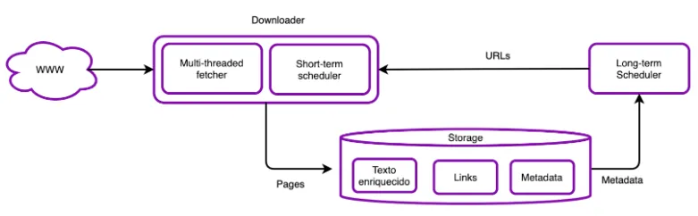

- Arquitectura de un crawler
    
    Conformada por:
    
    - **Downloader**: Realiza la descarga de la páginas
        - **Planificador de corto plazo:** reordenar colas para cumplir con las **políticas de cortesía**
    - **Storage**: Realiza la indexación de las páginas y provee al planificador (scheduler) con metadata de los sitios a ser descargados
    - **Scheduler:** Mantiene una cola con las URLs a visitar
        - **Planificador de largo plazo:** decidir que páginas visitar luego para cumplir con los objetivos de **calidad** y **frescura**
            - Ordena la queue por prioridad y calidad, seǵun el criterio definido
            